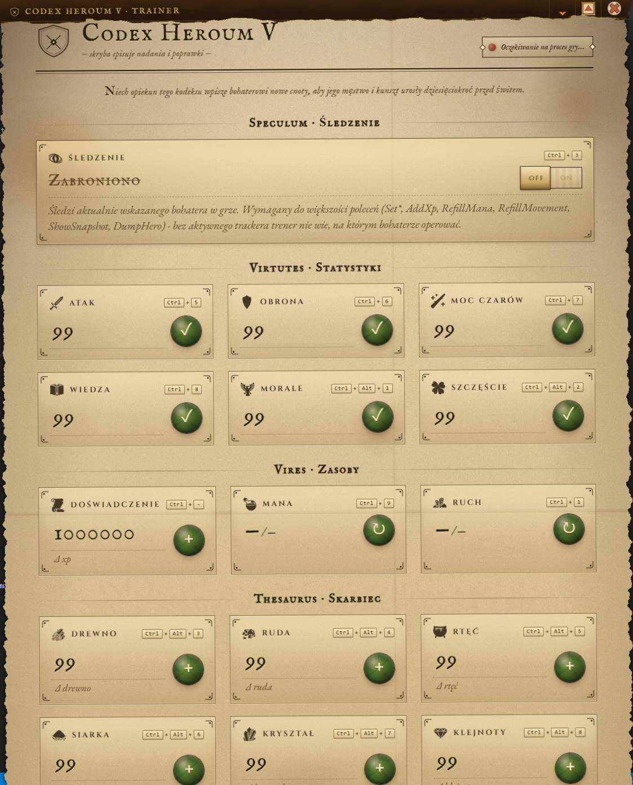

# Codex Heroum V - Trainer

Trener do Heroes of Might and Magic V (TotE / 5.5)
Aplikacja Tauri + React jest wizualną nakładką (UI) na sidecar w C#, który czyta i modyfikuje
pamięć procesu gry: statystyki bohatera, doświadczenie, manę, ruch oraz wszystkie siedem zasobów.

## Funkcje

- Ustawianie statystyk bohatera (Atak, Obrona, Moc Czarów, Wiedza, Morale, Szczęście).
- Dodawanie doświadczenia, uzupełnianie many i punktów ruchu.
- Modyfikacja zasobów (Drewno, Ruda, Rtęć, Siarka, Kryształ, Klejnoty, Złoto).
- Globalne skróty klawiszowe oraz okno komend / logów.

## Recommended IDE Setup

- [VS Code](https://code.visualstudio.com/) + [Tauri](https://marketplace.visualstudio.com/items?itemName=tauri-apps.tauri-vscode) + [rust-analyzer](https://marketplace.visualstudio.com/items?itemName=rust-lang.rust-analyzer)

## Powiązane projekty

- [h5_xp_trainer](https://github.com/PajakKamil/h5_xp_trainer) - sidecar trainera napisany w C# (kod źródłowy `h55_trainer-x86_64-pc-windows-msvc.exe`).
